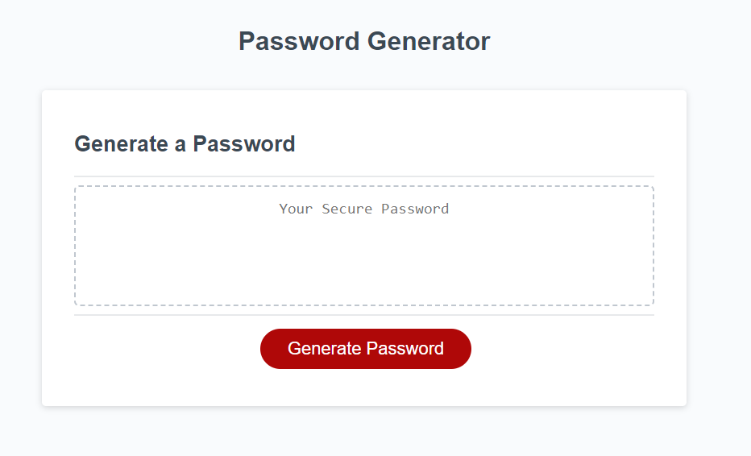

# Password Generator

## Description

This password generator will allow a user to input the desired number of characters for their password and will generate a password based on user requirements for: length, numbers, special characters, uppercase letters and lowercase letters. Follow the usage instructions below for more details. 

## Installation

N/A

## Usage

When arriving to the password generator page, click "generate password" to be prompted to the first pop up. Input your desired number of characters for your password (must be between 8-126 characters). 

Follow the prompts to confirm (Okay) or deny (Cancel) numbers, special characters, uppercase letters and lowercase letters for your password.

Once you have answered all prompts, your generated password will appear in the box.

## Credits

N/A

## License

Please refer to the LICENSE in the repo.